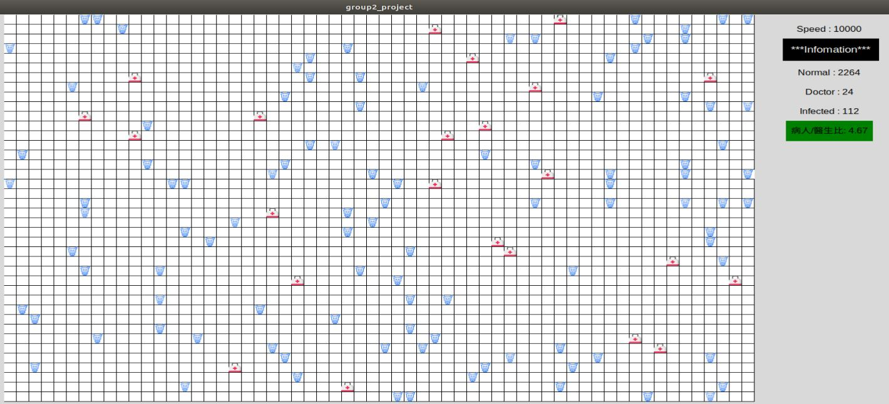
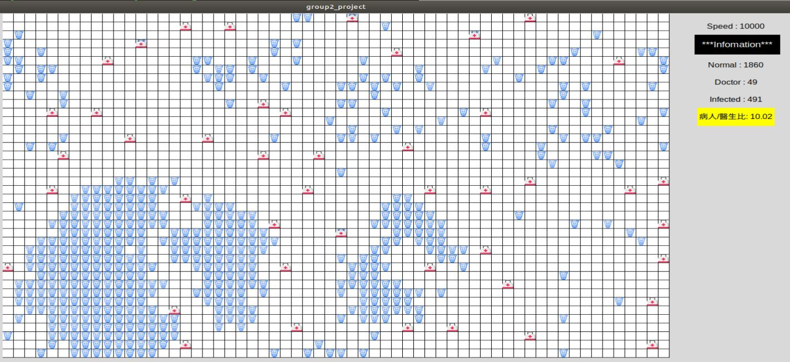
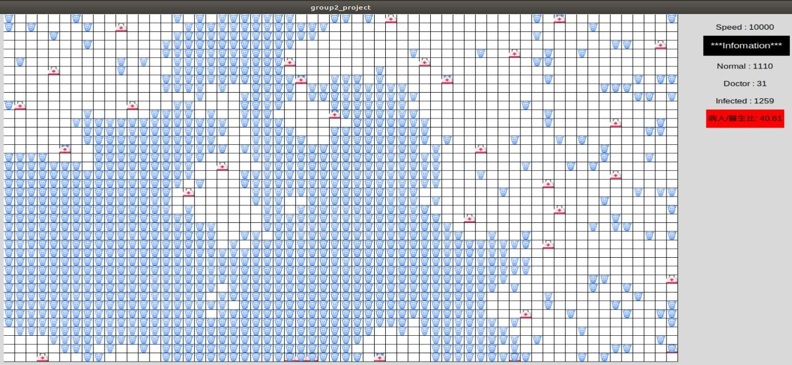

# Medical Service Industry Simulation Model

### Author
* 陳縵欣 ：負責程式撰寫與規則設計、架構設計、議題包裝、書面報告
    * Github: SophieXin9636
* 陳少洋 ：負責主題構想與規則設計、協助改善專案、書面報告
    * Github: SYangChen

### Simulation

Green: Peaceful



YELLOW：Warning



RED：Dangerous




### Project Design

程式實作以康威生命遊戲(Conway's Game of Life)為啟發，模擬台灣目前醫療人力情境。以醫院人力角色情境，主要分別有三種類型實作，以狀態分為：一般居民(Normal)、受感染的居民(Infected)(或就醫居民Patient，本篇簡稱患者)，以及醫師(Doctor)。<br>
　　在描述實作之前，依據衛生福利部統計來做為程式上的參數設定，例如患者與醫師比例(ratio)等。針對能夠專科治療疾病的西醫師，根據衛生福利部統計，合法執業醫師人數約為47,426人，於107年度全台灣醫院平均每日服務量為440,535人次，其中包含門診420,283人次，與急診20,252人次。台灣目前患者與醫師比為440,535/47,426  = 9.289。此外，根據衛生福利部107年專科醫師核准發證人數為1,373位，平均一日核發3.76位(1,373人 / 365日)醫師。<br>
其相關參數定義如下：

* `normal`：尚無受感染、生病，而無須就醫及看診的一般居民。
* `doctor`：專責看診、治療的醫師。
* `Infected` (或 `Patient` )：突發感染或是被感染而就醫的居民(統稱患者)。
* `self_healing_ratio`：受到某個疾病感染的痊癒機率，預設為 0.4，並期望在無須醫師的治療下痊癒。
* `turn`：程式實作上稱為輪次，實際在模擬以時間日為基本單位。
* `ratio`：患者與醫師比，等同於患者除醫師之比例，即 9.289。


### Algorithm

程式以康威生命模型為基礎的變形實作。<br>
每一輪次(每日)：

1. 每日隨機產生 15 ~ 25位 由一般居民突發性感染 (就醫)。
2. 每日產生 “痊癒機率×目前患者人數” 患者會自我痊癒。
3. 每日隨機產生 2 ~ 6位 (由 3.76 四捨五入為 4，期望值為 4) 的執業醫師。


### Framework

程式實作上以 MVC 模式 **(Model–view–controller)** 作為軟體的架構設計，其中：

* Model 負責演算法及邏輯處理
  * 負責規則 (函式 `rule()` )，每輪日產生醫師與患者 (函式 `generate()`)，計算醫師、患者、居民的邏輯處理 (函式 `countPeople()` )、處理超出邊界問題 (函式 `overBorder()`)、印出模擬世界 (函式`showWorld()`)。
* View 負責使用者圖形介面
  * 負責建立 1800×1000 大小之視窗、產生 canvas 畫布、加速及減速按鈕、顏色標記、Label (印出居民、醫師、患者、患者與醫師比等相關資訊)、載入圖片。
* Controller 負責請求控制及訊號控制
  * 負責按鈕的加速及減速控制。

### Install

```
$ sudo apt-get install python3
$ sudo apt-get install python3-tk
```

### Environment
Ubuntu 18.04

### Run
```
$ python3 main.py
```
When main.py exiting, it will add information about medical statistic into result.txt


### Complement

Running main.py when program crash (Def: When CPU usage is 100%), it will restart
```
./autorun
```


